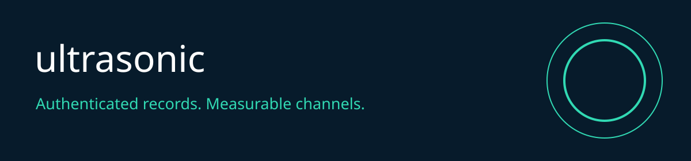

# ultrasonic v2 alpha

Ultrasonic v2 encrypts small data records, rejects replay, and measures a simulated acoustic channel. Received data stays data. It never runs commands or activates speakers or microphones.

## Capabilities

| Capability | Implemented behavior |
| :--- | :--- |
| Record protection | AES256 GCM authenticated records |
| Replay protection | Private persistent SQLite ledger with serialized transactions |
| Channel | Vectorized phase independent binary FSK at 500 raw bits/s |
| Execution boundary | Inert JSON only, no shell or audio device access |
| CLI and MCP | Local official SDK stdio server, fixed bounded actions |
| Evaluation | Tests, reproducible benchmark and unsigned hash receipts |
| Governance | MetaHarness profiles, Autogenous gate, explicit human promotion |

## Install and use

Python 3.11 or newer and Node 22.16 or newer are required.

```sh
python -m venv .venv
. .venv/bin/activate
python -m pip install -r requirements-v2.txt
python -m pip install --no-deps .
python -m ultrasonic_v2 fixture
python -m unittest discover -s tests_v2 -v
python -m ultrasonic_v2 benchmark
npm ci --prefix .harness/runtime
node .harness/runtime/cli.mjs status
node .harness/runtime/cli.mjs benchmark
RUV_ALLOW_VALIDATION=1 node .harness/runtime/cli.mjs test
node .harness/runtime/cli.mjs mcp
```

For a separate Python environment set `RUV_PYTHON` to its absolute executable path. MCP clients launch `node` with the absolute repository path to `.harness/runtime/cli.mjs` and argument `mcp`. The caller cannot supply commands, paths, keys or environment variables. Tools expose status, tests, benchmarks and domain operations. Read policy at `ruv://ultrasonic/policy`.

## MetaHarness and operations

See [generated harness](.harness/generated/README.md), [security and architecture](docs/ADR-001.md), [validation](docs/validation.md), and [benchmark evidence](docs/benchmark.json). Validation is opt in through the operator environment. Each process has a 30 second deadline, 32 KiB input and 64 KiB output limit; only one operation runs at a time. Receipts are local hashes, not signed attestations. CI builds a wheel and uploads it after passing tests. Publishing to a package registry remains an explicit release action.

## Limits

The benchmark is an aligned numerical simulation. It does not establish room range, hardware compatibility, timing acquisition or ultrasonic inaudibility. Replay protection requires preserving the ledger for the full lifetime of a key. Never restore an older ledger while retaining the key. Legacy media code is archival and excluded from the v2 package; its unauthenticated HTTP launcher is retired.

## Related projects

[RuFlo](https://github.com/ruvnet/ruflo) coordinates work. [MetaHarness](https://github.com/ruvnet/metaharness) supplies host profiles and evaluation. [Autogenous](https://github.com/ruvnet/autogenous) supplies promotion gates. [RuVector](https://github.com/ruvnet/ruvector) supplies retrieval primitives. [Federation](https://x.ruv.io/mcp) carries observations, never implicit execution authority. [Revival tracking](https://github.com/ruvnet/ultrasonic/issues/1).
