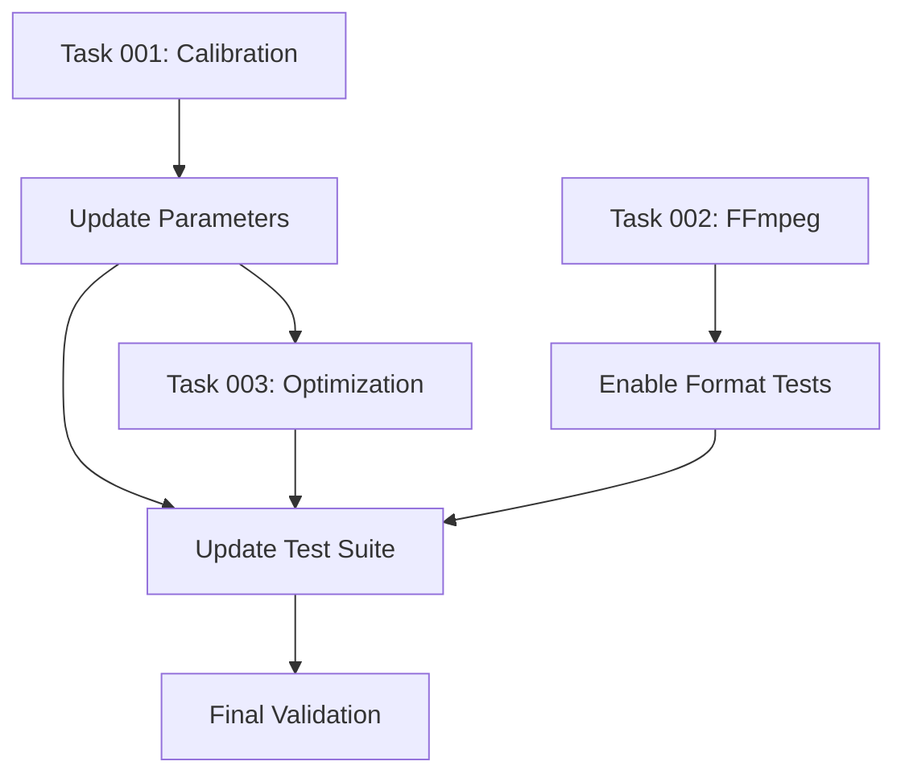

# Integration Plan

## Overview
This document outlines how the three main tasks integrate and their dependencies.

## Integration Sequence

## Phase 1: Calibration (Current)
1. Analyze failing tests
2. Discover optimal parameters
3. Update encoder/decoder with new values
4. Document in memory bank

## Phase 2: Dependencies (Parallel)
1. Install FFmpeg
2. Enable all audio format tests
3. Verify format conversions

## Phase 3: Optimization (Sequential)
1. Use calibrated values as baseline
2. Profile performance
3. Implement optimizations
4. Maintain calibration accuracy

## Phase 4: Integration Testing
1. Run full test suite with all changes
2. Performance benchmarks
3. Cross-format validation
4. Real-world audio testing

## Critical Integration Points

### 1. Parameter Updates
- Location: `embed/ultrasonic_encoder.py`, `decode/ultrasonic_decoder.py`
- Format: Class constants or config dict
- Testing: Must run tests after each change

### 2. Test Threshold Updates
- Location: `tests/test_ultrasonic_*.py`
- Dependency: Calibration values
- Validation: All tests must pass

### 3. Performance Baselines
- Measure before optimization
- Document in memory bank
- Compare after each optimization

## Risk Mitigation

1. **Version Control**: Commit after each successful phase
2. **Rollback Plan**: Keep original values documented
3. **Incremental Testing**: Test each change in isolation
4. **Cross-validation**: Multiple agents verify critical changes

## Success Metrics

- [ ] 95%+ test pass rate
- [ ] All audio formats supported
- [ ] 5x performance improvement
- [ ] Documentation complete
- [ ] No regression in accuracy