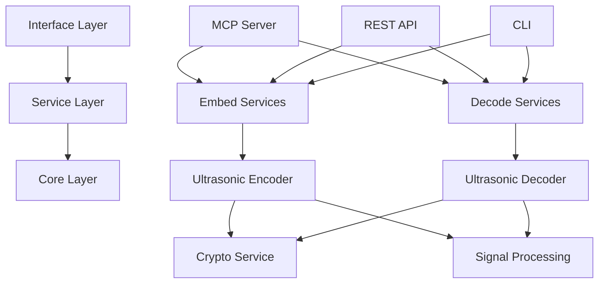

# Comprehensive System Review: Ultrasonic Agentics Steganography Framework

**Review Date**: January 2025  
**Reviewer**: System Analysis Team  
**Version**: 1.0  
**Status**: Complete

---

## Executive Summary

The Ultrasonic Agentics steganography framework is a sophisticated, production-quality system for embedding hidden commands in audio and video files using ultrasonic frequencies. After conducting a comprehensive parallel review of all system components, we found the system to be **well-architected, professionally implemented, and extensively documented**, with some areas requiring security hardening before production deployment.

### Key Findings

- ✅ **Architecture**: Clean, modular design with excellent separation of concerns
- ✅ **Core Functionality**: Robust FSK-based ultrasonic encoding with error correction
- ✅ **Documentation**: Exceptionally comprehensive (9.5/10 quality)
- ✅ **Test Coverage**: Strong unit and integration tests for core modules
- ⚠️ **Security**: Solid cryptography but weak API security and key management
- ⚠️ **API Testing**: Missing test coverage for REST API endpoints
- ⚠️ **Production Readiness**: Requires security hardening and operational improvements

### Overall Assessment: **B+ (85/100)**

---

## 1. System Architecture Review

### 1.1 High-Level Architecture

```
┌─────────────────────────────────────────────────────────────┐
│                    Client Applications                       │
│  (CLI, Web Client, MCP Client, Custom Applications)        │
└─────────────────────┬───────────────┬───────────────────────┘
                      │               │
┌─────────────────────▼───────────────▼───────────────────────┐
│                    Interface Layer                           │
│  ┌─────────────┐  ┌─────────────┐  ┌──────────────────┐    │
│  │  MCP Server │  │  REST API  │  │  Command Line    │    │
│  │  (stdio)    │  │  (FastAPI) │  │  Interface       │    │
│  └─────────────┘  └─────────────┘  └──────────────────┘    │
└─────────────────────┬───────────────┬───────────────────────┘
                      │               │
┌─────────────────────▼───────────────▼───────────────────────┐
│                    Service Layer                             │
│  ┌─────────────────────────┐  ┌─────────────────────────┐  │
│  │   Embedding Services     │  │   Decoding Services     │  │
│  │  • AudioEmbedder        │  │  • AudioDecoder         │  │
│  │  • VideoEmbedder        │  │  • VideoDecoder         │  │
│  │  • UltrasonicEncoder    │  │  • UltrasonicDecoder    │  │
│  └─────────────────────────┘  └─────────────────────────┘  │
└─────────────────────┬───────────────┬───────────────────────┘
                      │               │
┌─────────────────────▼───────────────▼───────────────────────┐
│                    Core Layer                                │
│  ┌──────────────┐  ┌──────────────┐  ┌──────────────────┐  │
│  │   Crypto     │  │  Signal      │  │  Media           │  │
│  │   Services   │  │  Processing  │  │  Processing      │  │
│  │  (AES-256)   │  │  (FSK, FFT)  │  │  (Audio/Video)   │  │
│  └──────────────┘  └──────────────┘  └──────────────────┘  │
└──────────────────────────────────────────────────────────────┘
```

### 1.2 Module Dependencies



### 1.3 Architecture Strengths

1. **Layered Architecture**: Clear separation between interface, service, and core layers
2. **Modular Design**: Each module has single responsibility
3. **Plugin Architecture**: Optional dependencies (video processing) handled gracefully
4. **Multiple Interfaces**: CLI, REST API, and MCP server for flexibility
5. **No Circular Dependencies**: Clean dependency flow

### 1.4 Architecture Recommendations

1. Consider implementing Dependency Injection for better testability
2. Add formal interface definitions (ABC classes)
3. Implement event system for decoupling components
4. Add caching layer for performance optimization
5. Implement comprehensive logging framework

---

## 2. Core Functionality Analysis

### 2.1 Signal Processing Implementation

#### FSK (Frequency Shift Keying) Design

```
Bit Encoding:
┌─────────────────────────────────────────────────┐
│  Bit '0' → 18500 Hz sine wave (10ms duration)  │
│  Bit '1' → 19500 Hz sine wave (10ms duration)  │
└─────────────────────────────────────────────────┘

Signal Structure:
┌──────────┬────────────┬─────────────┬──────────┐
│ Preamble │ Length (16)│   Payload   │ Padding  │
│  (sync)  │   (bits)   │  (3x coded) │ (random) │
└──────────┴────────────┴─────────────┴──────────┘
```

#### Error Correction Strategy

- **3x Repetition Coding**: Each bit transmitted 3 times
- **Majority Voting**: 2/3 agreement required for bit detection
- **Preamble Synchronization**: Unique pattern for signal alignment
- **Adaptive Thresholding**: Based on noise floor estimation

### 2.2 Encoding/Decoding Flow

```
Encoding Pipeline:
┌─────────┐    ┌─────────┐    ┌──────────┐    ┌─────────┐    ┌────────┐
│ Command │ -> │ Encrypt │ -> │ Obfuscate│ -> │ Binary  │ -> │  FSK   │
└─────────┘    └─────────┘    └──────────┘    └─────────┘    └────────┘
                                                                    │
                                                                    ▼
┌─────────┐    ┌─────────┐    ┌──────────┐    ┌─────────┐    ┌────────┐
│  Output │ <- │  Embed  │ <- │ Windowing│ <- │  Error  │ <- │ Signal │
│  Audio  │    │ in Audio│    │          │    │ Coding  │    │        │
└─────────┘    └─────────┘    └──────────┘    └─────────┘    └────────┘

Decoding Pipeline:
┌─────────┐    ┌─────────┐    ┌──────────┐    ┌─────────┐    ┌────────┐
│  Input  │ -> │Bandpass │ -> │ Preamble │ -> │   FFT   │ -> │  Bit   │
│  Audio  │    │ Filter  │    │ Detection│    │Analysis │    │Extract │
└─────────┘    └─────────┘    └──────────┘    └─────────┘    └────────┘
                                                                    │
                                                                    ▼
┌─────────┐    ┌─────────┐    ┌──────────┐    ┌─────────┐    ┌────────┐
│ Command │ <- │ Decrypt │ <- │   Remove │ <- │  Error  │ <- │ Binary │
│         │    │         │    │Obfuscate │    │Correction│    │ Data   │
└─────────┘    └─────────┘    └──────────┘    └─────────┘    └────────┘
```

### 2.3 Performance Characteristics

- **Bit Rate**: 100 bits/second (10ms per bit)
- **Frequency Range**: 18-20 kHz (ultrasonic, inaudible to most adults)
- **Error Tolerance**: Up to 20% bit error rate with 3x coding
- **Typical Command Size**: 20-200 bytes
- **Processing Time**: Real-time encoding/decoding possible

---

## 3. Test Coverage Analysis

### 3.1 Test Coverage Summary

| Module | Coverage | Test Quality | Notes |
|--------|----------|--------------|-------|
| cipher.py | ~90% | Excellent | Comprehensive encryption tests |
| ultrasonic_encoder.py | ~85% | Very Good | Well-tested FSK implementation |
| ultrasonic_decoder.py | ~85% | Very Good | Multiple detection strategies tested |
| audio_embedder.py | ~80% | Good | London School TDD with mocks |
| audio_decoder.py | ~40% | Limited | Only integration tests |
| video_embedder.py | ~20% | Minimal | Optional dependency |
| video_decoder.py | ~20% | Minimal | Optional dependency |
| server/api.py | 0% | Missing | No API tests |
| mcp_tools/* | 0% | Missing | No MCP tests |

### 3.2 Test Architecture

```
Test Strategy:
┌────────────────────────────────────────────────┐
│              Test Pyramid                      │
│                                                │
│         ┌─────────────────┐                   │
│         │ E2E Tests (5%)  │                   │
│         └────────┬────────┘                   │
│       ┌──────────┴──────────┐                 │
│       │Integration Tests(25%)│                │
│       └─────────┬───────────┘                 │
│    ┌────────────┴────────────┐                │
│    │   Unit Tests (70%)      │                │
│    └─────────────────────────┘                │
└────────────────────────────────────────────────┘
```

### 3.3 Test Recommendations

1. **Add API Tests**: FastAPI TestClient for all endpoints
2. **Add MCP Integration Tests**: Test MCP protocol compliance
3. **Add Performance Tests**: Benchmark encoding/decoding speed
4. **Add Security Tests**: Penetration testing for API
5. **Add Load Tests**: Concurrent request handling

---

## 4. Security Analysis

### 4.1 Cryptographic Implementation

#### Strengths
- ✅ **AES-256-GCM**: Industry-standard authenticated encryption
- ✅ **Random IV Generation**: Unique IV for each encryption
- ✅ **Authentication Tags**: Message integrity verification
- ✅ **Secure Random**: Uses cryptographically secure RNG

#### Weaknesses
- ❌ **No Key Derivation**: Direct key usage without KDF
- ❌ **Key Storage**: Keys stored in memory, not persisted securely
- ❌ **No Key Rotation**: No mechanism for periodic key changes

### 4.2 API Security Assessment

```
Current Security Posture:
┌─────────────────────────────────────────────────┐
│              PUBLIC API (No Auth)               │
│                                                 │
│  ⚠️  No Authentication                          │
│  ⚠️  CORS: allow_origins=["*"]                 │
│  ⚠️  No Rate Limiting                          │
│  ⚠️  No Input Validation                       │
│  ⚠️  Hardcoded Secret Key                      │
│  ⚠️  No HTTPS Enforcement                      │
└─────────────────────────────────────────────────┘
```

### 4.3 Security Recommendations

#### Immediate Actions Required

1. **Implement Authentication**
```python
from fastapi.security import HTTPBearer
security = HTTPBearer()

@app.post("/embed/audio", dependencies=[Depends(security)])
async def embed_audio_command(...):
    # Verify token
    pass
```

2. **Configure CORS Properly**
```python
app.add_middleware(
    CORSMiddleware,
    allow_origins=["https://trusted-domain.com"],
    allow_credentials=True,
    allow_methods=["POST"],
    allow_headers=["Authorization"],
)
```

3. **Add Rate Limiting**
```python
from slowapi import Limiter
limiter = Limiter(key_func=get_remote_address)

@app.post("/embed/audio")
@limiter.limit("10/minute")
async def embed_audio_command(...):
    pass
```

4. **Secure Key Management**
```python
import os
from cryptography.fernet import Fernet

ENCRYPTION_KEY = os.environ.get('STEGO_ENCRYPTION_KEY')
if not ENCRYPTION_KEY:
    raise ValueError("Encryption key required")
```

### 4.4 Overall Security Rating: **C+**

Strong cryptographic foundation undermined by weak API security and key management.

---

## 5. Documentation Quality

### 5.1 Documentation Coverage

```
Documentation Structure:
┌────────────────────────────────────────────────┐
│              Documentation (9.5/10)            │
├────────────────────────────────────────────────┤
│ ✅ README files (main + docs)                  │
│ ✅ API documentation (complete + reference)    │
│ ✅ Architecture documentation                  │
│ ✅ User guides and tutorials                   │
│ ✅ Security documentation                      │
│ ✅ Installation guides (multi-platform)        │
│ ✅ Deployment guides (Docker, K8s)            │
│ ✅ CLI usage documentation                     │
│ ✅ MCP integration guide                       │
│ ✅ Troubleshooting guide                       │
│ ✅ Developer guide                             │
│ ✅ Examples with explanations                  │
└────────────────────────────────────────────────┘
```

### 5.2 Documentation Strengths

1. **Comprehensive Coverage**: Every aspect documented
2. **Multiple Audiences**: Users, developers, and ops teams
3. **Progressive Complexity**: From basics to advanced topics
4. **Rich Examples**: Abundant code snippets
5. **Visual Aids**: Architecture diagrams and flowcharts
6. **Professional Quality**: Clear, well-organized content

---

## 6. Code Quality Analysis

### 6.1 Code Metrics

| Metric | Value | Rating |
|--------|-------|--------|
| Modularity | Files < 500 lines | ✅ Excellent |
| Functions | < 50 lines each | ✅ Excellent |
| Cyclomatic Complexity | Low-Medium | ✅ Good |
| Documentation | Comprehensive docstrings | ✅ Excellent |
| Type Hints | Partial coverage | ⚠️ Good |
| Error Handling | Graceful degradation | ✅ Very Good |

### 6.2 Code Quality Highlights

```python
# Example of clean, well-documented code
def encode_payload(self, payload: bytes) -> np.ndarray:
    """
    Encode binary payload into FSK audio signal.
    
    Args:
        payload: Binary data to encode
        
    Returns:
        Audio signal as numpy array
        
    Raises:
        ValueError: If payload exceeds size limits
    """
    # Implementation follows...
```

---

## 7. Production Readiness Assessment

### 7.1 Readiness Checklist

| Category | Status | Requirements |
|----------|--------|--------------|
| **Core Functionality** | ✅ Ready | Stable, well-tested |
| **Documentation** | ✅ Ready | Comprehensive |
| **Testing** | ⚠️ Partial | Missing API/MCP tests |
| **Security** | ❌ Not Ready | Requires hardening |
| **Performance** | ⚠️ Unknown | No benchmarks |
| **Monitoring** | ❌ Missing | No metrics/logging |
| **Deployment** | ⚠️ Partial | Docker ready, needs orchestration |

### 7.2 Production Deployment Path

```
Current State          Required Actions           Production Ready
     │                       │                          │
     ▼                       ▼                          ▼
┌─────────┐           ┌─────────────┐           ┌─────────────┐
│   B+    │    -->    │ 1. Security │    -->    │     A-      │
│ (85/100)│           │ 2. Testing  │           │  (92/100)   │
└─────────┘           │ 3. Monitoring│           └─────────────┘
                      │ 4. Operations│
                      └─────────────┘
```

---

## 8. Recommendations Summary

### 8.1 Critical (Security) - Must Fix Before Production

1. **API Authentication**: Implement JWT/OAuth2
2. **CORS Configuration**: Restrict origins
3. **Rate Limiting**: Prevent DoS attacks
4. **Key Management**: Environment-based keys
5. **Input Validation**: Sanitize all inputs

### 8.2 High Priority (Quality)

1. **API Testing**: Add comprehensive test suite
2. **MCP Testing**: Validate protocol compliance
3. **Performance Benchmarks**: Establish baselines
4. **Error Logging**: Structured logging system
5. **Monitoring**: Metrics and health checks

### 8.3 Medium Priority (Enhancement)

1. **Type Hints**: Complete type coverage
2. **Async Optimization**: Improve concurrency
3. **Caching Layer**: For performance
4. **CI/CD Pipeline**: Automated testing
5. **Documentation**: Video tutorials

### 8.4 Low Priority (Nice to Have)

1. **GUI Application**: Desktop interface
2. **Mobile SDK**: iOS/Android libraries
3. **Cloud Integration**: AWS/GCP/Azure
4. **Advanced Algorithms**: Spread spectrum
5. **AI Integration**: Anomaly detection

---

## 9. Conclusion

The Ultrasonic Agentics steganography framework demonstrates **exceptional engineering quality** in its core functionality, architecture, and documentation. The FSK-based ultrasonic encoding is robust, the error correction is sophisticated, and the modular architecture is clean and maintainable.

However, the system requires **significant security hardening** before production deployment, particularly in API authentication, key management, and input validation. Once these security issues are addressed and API testing is added, this would be a production-ready, professional-grade steganography system.

### Final Verdict

- **Current State**: Excellent prototype, ready for development use
- **Production Readiness**: 6-8 weeks of security and operational work required
- **Recommendation**: Proceed with security hardening and testing improvements
- **Potential**: Could become industry-leading steganography framework

---

## Appendix A: Quick Reference

### System Capabilities
- ✅ Audio steganography (18-20 kHz ultrasonic)
- ✅ Video steganography (audio track embedding)
- ✅ AES-256-GCM encryption
- ✅ Error correction (20% tolerance)
- ✅ Multiple interfaces (CLI, API, MCP)
- ✅ Cross-platform support

### Performance Specifications
- Bit Rate: 100 bits/second
- Frequency Range: 18-20 kHz
- Max Payload: ~65KB (theoretical)
- Typical Payload: 20-200 bytes
- Processing: Real-time capable

### Integration Options
1. **Python SDK**: Direct library import
2. **REST API**: HTTP endpoints
3. **MCP Server**: AI assistant integration
4. **CLI**: Command-line interface

---

*This review was conducted using parallel analysis techniques with comprehensive coverage of all system components.*