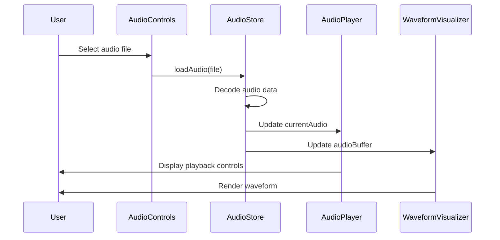
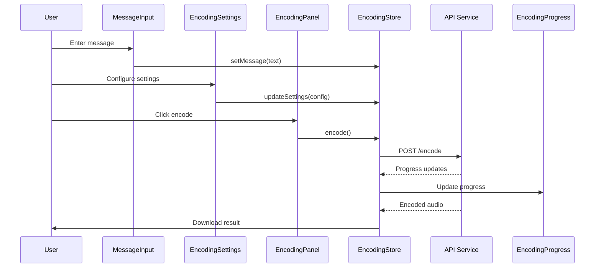
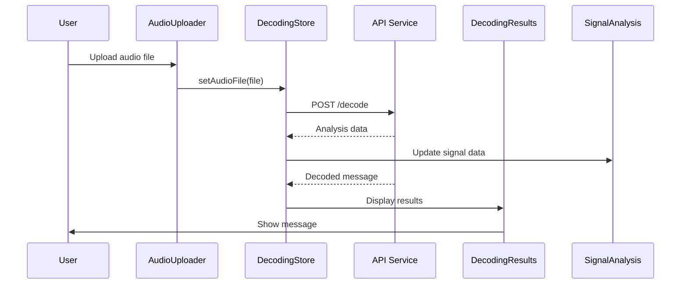

# Data Flow Architecture

## Overview
This document describes the data flow patterns between components in the Ultrasonic-Agentics UI application, including state management, event handling, and API communication.

## Core Data Flow Patterns

### 1. Unidirectional Data Flow
```
User Action → Component → Store Action → State Update → Component Re-render
```

### 2. Component Communication Patterns

#### Parent-Child Communication
- **Props Down**: Data flows from parent to child via props
- **Events Up**: Child components emit events to parent via callbacks

```typescript
// Parent Component
function EncodingPanel() {
  const [message, setMessage] = useState('')
  
  return (
    <MessageInput 
      value={message}
      onChange={setMessage}  // Callback passed down
    />
  )
}

// Child Component
function MessageInput({ value, onChange }) {
  return (
    <input 
      value={value}
      onChange={(e) => onChange(e.target.value)}  // Event emitted up
    />
  )
}
```

#### Sibling Communication via Store
Components at the same level communicate through the shared store:

```typescript
// Component A: Audio Player
function AudioPlayer() {
  const { loadAudio } = useAudioStore()
  
  const handleFileLoad = (file) => {
    loadAudio(file)  // Updates store
  }
}

// Component B: Encoding Panel
function EncodingPanel() {
  const audioBuffer = useAudioStore(state => state.currentAudio.buffer)
  // Reacts to audio changes from Component A
}
```

## Major Data Flows

### 1. Audio Loading Flow


### 2. Message Encoding Flow


### 3. Audio Decoding Flow


## State Synchronization Patterns

### 1. Optimistic Updates
For better UX, update UI immediately while API calls are in progress:

```typescript
// Encoding Store
const encode = async (audio) => {
  // Optimistic update
  set(state => {
    state.isEncoding = true
    state.progress = 0
  })
  
  try {
    const result = await api.encode(audio)
    // Success update
    set(state => {
      state.result = result
      state.isEncoding = false
    })
  } catch (error) {
    // Rollback on error
    set(state => {
      state.isEncoding = false
      state.error = error
    })
  }
}
```

### 2. Debounced Updates
For frequently changing values (e.g., settings sliders):

```typescript
// Settings Component
const debouncedUpdate = useMemo(
  () => debounce((value) => {
    updateSettings({ frequency: value })
  }, 300),
  [updateSettings]
)
```

### 3. Computed State
Derive values from multiple stores:

```typescript
// Custom Hook
function useEncodingCapacity() {
  const audioDuration = useAudioStore(state => state.playbackState.duration)
  const settings = useEncodingStore(state => state.settings)
  
  return useMemo(() => {
    if (!audioDuration) return 0
    return calculateCapacity(audioDuration, settings)
  }, [audioDuration, settings])
}
```

## API Communication Patterns

### 1. Request/Response Pattern
Standard REST API calls with loading states:

```typescript
interface APIState {
  data: any
  loading: boolean
  error: Error | null
}

// In store
const fetchData = async () => {
  set({ loading: true, error: null })
  
  try {
    const data = await api.getData()
    set({ data, loading: false })
  } catch (error) {
    set({ error, loading: false })
  }
}
```

### 2. Progress Tracking Pattern
For long-running operations:

```typescript
// API Service
const encodeWithProgress = async (data, onProgress) => {
  const response = await fetch('/api/encode', {
    method: 'POST',
    body: data
  })
  
  const reader = response.body.getReader()
  const contentLength = response.headers.get('Content-Length')
  
  let receivedLength = 0
  while (true) {
    const { done, value } = await reader.read()
    if (done) break
    
    receivedLength += value.length
    onProgress(receivedLength / contentLength * 100)
  }
}
```

### 3. WebSocket Pattern (Future)
For real-time updates:

```typescript
// WebSocket Store
const connectWebSocket = () => {
  const ws = new WebSocket('ws://localhost:3000/live')
  
  ws.onmessage = (event) => {
    const data = JSON.parse(event.data)
    
    switch (data.type) {
      case 'ENCODING_PROGRESS':
        set({ progress: data.payload.progress })
        break
      case 'ENCODING_COMPLETE':
        set({ result: data.payload.result })
        break
    }
  }
}
```

## Error Handling Patterns

### 1. Global Error Boundary
Catch and display errors at the app level:

```typescript
// App.tsx
<ErrorBoundary fallback={<ErrorFallback />}>
  <Router>
    <Routes>...</Routes>
  </Router>
</ErrorBoundary>
```

### 2. Local Error States
Handle errors within components:

```typescript
function AudioUploader() {
  const [error, setError] = useState(null)
  
  const handleUpload = async (file) => {
    try {
      await validateFile(file)
      await uploadFile(file)
    } catch (err) {
      setError(err.message)
    }
  }
  
  return (
    <>
      {error && <Alert type="error">{error}</Alert>}
      <FileInput onChange={handleUpload} />
    </>
  )
}
```

### 3. Store Error Handling
Centralized error management:

```typescript
// UI Store
interface UIStore {
  notifications: Notification[]
  
  showError: (error: Error) => void
  showSuccess: (message: string) => void
}

// Any component
try {
  await someOperation()
  showSuccess('Operation completed!')
} catch (error) {
  showError(error)
}
```

## Performance Optimization Patterns

### 1. Selective Subscriptions
Only subscribe to needed state slices:

```typescript
// Bad - subscribes to entire store
const store = useAudioStore()

// Good - subscribes only to needed values
const isPlaying = useAudioStore(state => state.playbackState.isPlaying)
const volume = useAudioStore(state => state.playbackState.volume)
```

### 2. Memoization
Prevent unnecessary re-renders:

```typescript
const ExpensiveComponent = memo(({ data }) => {
  const processedData = useMemo(
    () => expensiveProcessing(data),
    [data]
  )
  
  return <div>{processedData}</div>
})
```

### 3. Lazy Loading
Load components on demand:

```typescript
const AnalysisPanel = lazy(() => import('./AnalysisPanel'))

function App() {
  return (
    <Suspense fallback={<LoadingSpinner />}>
      <AnalysisPanel />
    </Suspense>
  )
}
```

## Testing Data Flows

### 1. Store Testing
```typescript
describe('Audio Store Flow', () => {
  it('should load audio and update related states', async () => {
    const { loadAudio } = useAudioStore.getState()
    
    await loadAudio(mockFile)
    
    const state = useAudioStore.getState()
    expect(state.currentAudio.buffer).toBeDefined()
    expect(state.playbackState.duration).toBeGreaterThan(0)
  })
})
```

### 2. Component Integration Testing
```typescript
describe('Encoding Flow', () => {
  it('should complete full encoding workflow', async () => {
    render(<App />)
    
    // Load audio
    const fileInput = screen.getByLabelText('Select audio file')
    await userEvent.upload(fileInput, mockAudioFile)
    
    // Enter message
    const messageInput = screen.getByLabelText('Message to encode')
    await userEvent.type(messageInput, 'Secret message')
    
    // Start encoding
    const encodeButton = screen.getByRole('button', { name: 'Encode' })
    await userEvent.click(encodeButton)
    
    // Verify result
    await waitFor(() => {
      expect(screen.getByText('Encoding complete')).toBeInTheDocument()
    })
  })
})
```

## Best Practices

1. **Keep data flow unidirectional**: Always flow from stores to components
2. **Use typed interfaces**: Define clear contracts between components
3. **Handle loading states**: Show appropriate UI during async operations
4. **Implement error boundaries**: Gracefully handle unexpected errors
5. **Optimize subscriptions**: Only subscribe to necessary state slices
6. **Document side effects**: Clearly mark where external calls occur
7. **Test data flows**: Ensure reliability of critical paths

## Common Pitfalls to Avoid

1. **Circular dependencies**: Store A updates Store B which updates Store A
2. **Over-fetching**: Loading unnecessary data
3. **Memory leaks**: Not cleaning up subscriptions
4. **Race conditions**: Multiple async operations updating same state
5. **Prop drilling**: Passing props through many levels

## Migration Considerations

When adding new features:
1. Identify data sources and consumers
2. Design the flow before implementing
3. Consider existing patterns for consistency
4. Add proper error handling
5. Include loading states
6. Write tests for the flow
7. Document any deviations from standard patterns