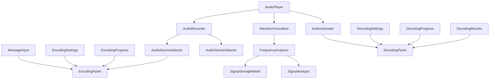

# Implementation Roadmap

## Overview
This roadmap outlines the development sequence for the Ultrasonic-Agentics UI, with clear priorities, dependencies, and milestones to guide efficient implementation.

## Development Priorities

### 🔴 Priority 1: Core Functionality (Weeks 1-2)
Essential components needed for basic encode/decode operations.

### 🟡 Priority 2: Enhanced Features (Weeks 3-4)
Components that improve user experience and add important functionality.

### 🟢 Priority 3: Nice to Have (Week 5+)
Advanced features that can be added after core functionality is complete.

## Implementation Phases

### Phase 1: Foundation (Week 1)
**Goal**: Establish core infrastructure and basic audio handling

#### Components to Build:
1. **AudioPlayer** (audio-controls.md)
   - Basic playback controls
   - File loading capability
   - State management integration
   
2. **MessageInput** (encoding-panel.md)
   - Text input with validation
   - Character counting
   - Basic error handling

3. **EncodingSettings** (encoding-panel.md)
   - Basic parameter controls
   - Preset selection
   - Settings validation

4. **EncodingProgress** (encoding-panel.md)
   - Progress bar component
   - Status messages
   - Result display

#### Infrastructure Setup:
- Initialize Zustand stores (audioStore, encodingStore)
- Set up API client with base endpoints
- Configure error boundaries
- Implement basic routing

#### Deliverables:
- [ ] User can load an audio file
- [ ] User can input a message
- [ ] User can see encoding settings
- [ ] Basic state management working

### Phase 2: Encoding Pipeline (Week 2)
**Goal**: Complete the encoding workflow

#### Components to Build:
1. **EncodingPanel** (encoding-panel.md)
   - Integrate MessageInput, EncodingSettings, EncodingProgress
   - Wire up to encodingStore
   - Handle encoding workflow

2. **AudioRecorder** (audio-controls.md)
   - Microphone access
   - Recording controls
   - Audio preview

3. **AudioSourceSelector** (encoding-panel.md)
   - File upload integration
   - Recording integration
   - Source switching logic

#### API Integration:
- Implement `/api/encode` endpoint integration
- Add progress tracking via SSE or polling
- Handle file uploads and downloads

#### Deliverables:
- [ ] Complete encoding workflow functional
- [ ] User can encode messages into audio files
- [ ] Progress tracking during encoding
- [ ] Download encoded audio files

### Phase 3: Decoding Pipeline (Week 3)
**Goal**: Implement message extraction functionality

#### Components to Build:
1. **AudioUploader** (decoding-panel.md)
   - Drag-and-drop support
   - File validation
   - Preview integration

2. **DecodingSettings** (decoding-panel.md)
   - Detection parameters
   - Auto-detect mode
   - Manual configuration

3. **DecodingProgress** (decoding-panel.md)
   - Real-time progress
   - Stage indicators
   - Cancel functionality

4. **DecodingResults** (decoding-panel.md)
   - Message display
   - Confidence scores
   - Export options

5. **DecodingPanel** (decoding-panel.md)
   - Integrate all decoding components
   - Wire up to decodingStore
   - Handle decoding workflow

#### Deliverables:
- [ ] Complete decoding workflow functional
- [ ] User can extract messages from audio files
- [ ] Confidence scoring for decoded messages
- [ ] Export decoded messages

### Phase 4: Visualization (Week 4)
**Goal**: Add visual feedback and analysis tools

#### Components to Build:
1. **WaveformVisualizer** (waveform-display.md)
   - Canvas-based rendering
   - Zoom/pan controls
   - Integration with AudioPlayer

2. **AudioDeviceSelector** (audio-controls.md)
   - Device enumeration
   - Input/output selection
   - Permission handling

3. **SignalAnalysis** (decoding-panel.md)
   - Basic signal visualization
   - Detected region highlighting
   - Click-to-analyze regions

#### Deliverables:
- [ ] Waveform visualization in audio player
- [ ] Visual feedback during encoding/decoding
- [ ] Device selection for recording

### Phase 5: Polish & Advanced Features (Week 5+)
**Goal**: Enhance user experience and add advanced functionality

#### Components to Build:
1. **FrequencyAnalyzer** (waveform-display.md)
   - Real-time FFT display
   - Ultrasonic range highlighting
   - Multiple view modes

2. **SignalStrengthMeter** (waveform-display.md)
   - Signal quality indicators
   - Noise level display
   - Quality recommendations

3. **Batch Processing**
   - Multiple file handling
   - Queue management
   - Bulk operations

#### Deliverables:
- [ ] Advanced visualization tools
- [ ] Batch encoding/decoding
- [ ] Performance optimizations
- [ ] Enhanced error handling

## Dependencies Map

## Critical Path

The minimum viable product (MVP) path:
1. AudioPlayer → MessageInput + EncodingSettings → EncodingPanel → AudioUploader → DecodingPanel

This path ensures users can:
- Load audio files
- Encode messages
- Decode messages
- See results

## Risk Mitigation

### Technical Risks:
1. **Browser Compatibility**
   - Mitigation: Use feature detection and polyfills
   - Fallback: Server-side processing option

2. **Performance Issues**
   - Mitigation: Web Workers for heavy processing
   - Fallback: Chunked processing with progress

3. **Audio API Limitations**
   - Mitigation: Test across browsers early
   - Fallback: Pre-processed audio options

### Schedule Risks:
1. **Complex Integration**
   - Mitigation: Build isolated components first
   - Fallback: Simplify initial features

2. **API Dependencies**
   - Mitigation: Mock API during development
   - Fallback: Local processing options

## Success Criteria

### Week 1 Checkpoint:
- [ ] Basic audio playback working
- [ ] Message input functional
- [ ] Settings UI complete
- [ ] State management verified

### Week 2 Checkpoint:
- [ ] Full encoding workflow operational
- [ ] File handling robust
- [ ] Progress tracking accurate
- [ ] Error handling in place

### Week 3 Checkpoint:
- [ ] Decoding workflow complete
- [ ] Results display functional
- [ ] Both encode/decode working end-to-end

### Week 4 Checkpoint:
- [ ] Visualization integrated
- [ ] Performance acceptable
- [ ] UI polished

### Final Milestone:
- [ ] All Priority 1 & 2 features complete
- [ ] Performance targets met
- [ ] Comprehensive error handling
- [ ] User documentation ready

## Development Guidelines

### For Each Component:
1. **Start with TypeScript interfaces** - Define props and state types
2. **Build in isolation** - Use Storybook or similar
3. **Write tests early** - Unit and integration tests
4. **Document as you go** - Update coordination docs
5. **Consider accessibility** - ARIA labels, keyboard navigation
6. **Handle errors gracefully** - User-friendly messages
7. **Optimize last** - Functionality first, performance second

### Code Review Checklist:
- [ ] TypeScript types complete
- [ ] Component follows established patterns
- [ ] State management consistent
- [ ] Error boundaries in place
- [ ] Accessibility requirements met
- [ ] Tests passing
- [ ] Documentation updated

## Resource Allocation

### Suggested Team Structure:
- **Frontend Lead**: Architecture, state management, code reviews
- **UI Developer 1**: Audio controls, encoding components
- **UI Developer 2**: Decoding components, visualization
- **QA Engineer**: Testing, browser compatibility
- **Designer**: UI/UX refinements, accessibility

### Parallel Work Streams:
- Week 1: UI Dev 1 on audio controls, UI Dev 2 on encoding components
- Week 2: UI Dev 1 on recording, UI Dev 2 on API integration
- Week 3: Both developers on decoding pipeline
- Week 4: UI Dev 1 on visualization, UI Dev 2 on polish

## Next Steps

1. **Review and approve this roadmap** with the team
2. **Set up development environment** with agreed tooling
3. **Create component templates** for consistency
4. **Begin Phase 1 implementation** with AudioPlayer and MessageInput
5. **Schedule daily standups** to track progress
6. **Plan weekly demos** for stakeholder feedback